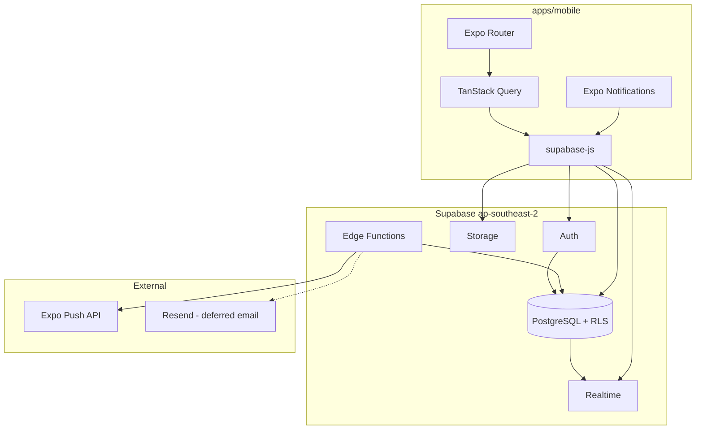
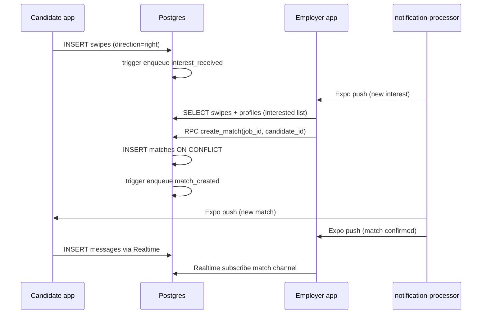
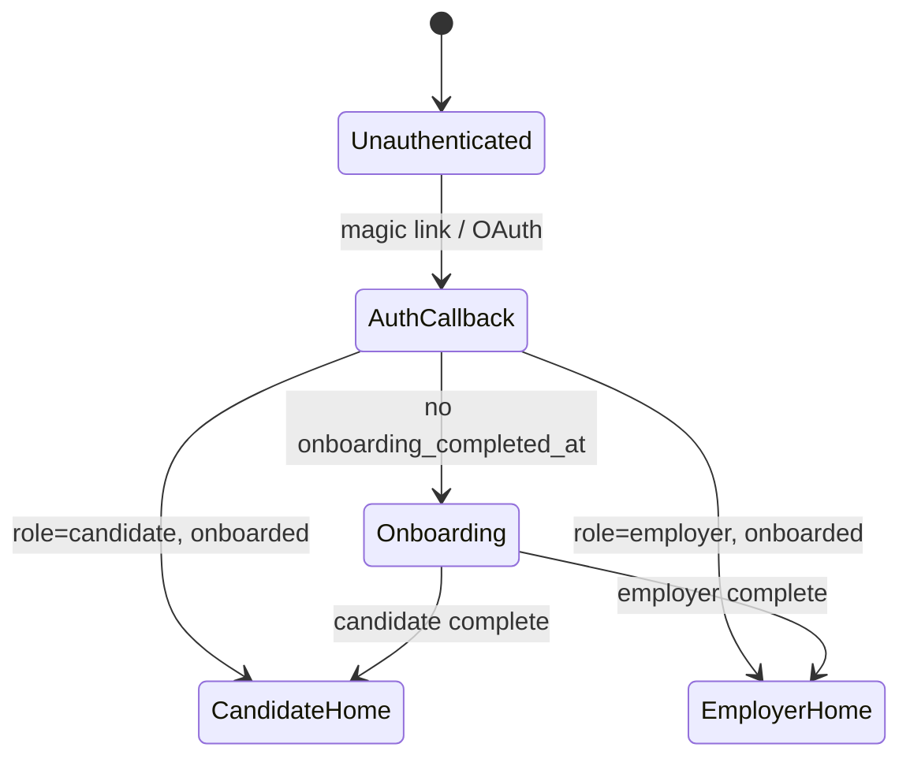

# feat: Hi-Hired MVP — Expo monorepo, Supabase backend, core mobile flows

## Summary

This plan takes Hi-Hired from a planning-only repository to a build-ready Expo monorepo with Supabase migrations 001–016 applied, role-based auth and onboarding, the candidate swipe deck, employer interested-list → chat match flow, realtime messaging with dual hire confirmation, and a reliable notification pipeline — plus EAS/CI wiring for internal beta. Implementation follows canonical docs (`STACK.md`, `docs/BACKEND.md`) without re-litigating locked product decisions.

---

## Problem Frame

Hi-Hired has complete product and backend specifications but no application code. Developers need a sequenced, dependency-ordered path from empty repo to an internally testable mobile MVP that validates the beachhead loop: employers post jobs, candidates swipe, employers review interested candidates and start chat, both parties confirm hire. Without a structured build plan, greenfield work risks implementing superseded patterns (Next.js web app, bilateral Tinder match, OneSignal) or missing App Store gates (reports, blocks, notification reliability).

---

## Assumptions

*This plan was authored without synchronous user confirmation. The items below are agent inferences — review before implementation proceeds.*

- Repo will be renamed or scaffolded as `hi-hired/` per `STACK.md`; current folder name `swipe-job-search` is treated as the working git root until rename.
- Three Supabase projects (dev/staging/prod) will be provisioned manually before U2; local `supabase start` suffices for developer iteration.
- Apple Sign-In and Google OAuth credentials will be supplied by the operator before TestFlight; magic link alone is acceptable for first internal build.
- Fair Work minimum pay validation uses a static lookup table in `packages/shared` for MVP beachhead categories (hospitality/retail), not a live Award API.
- Maestro smoke tests ship with U8; Detox remains deferred until pre–public beta per `STACK.md`.
- Employer job posting uses a simplified single-screen or two-step form (MVP fields from `02-mvp-definition.md`), not the multi-screen Instagram-style builder in `RECRUITER_FLOW.md`.

---

## Requirements

- R1. Scaffold pnpm monorepo with `apps/mobile`, `packages/shared`, `supabase/`, and CI skeleton per `STACK.md` monorepo layout.
- R2. Apply Supabase migrations 001–016 in order, including RLS, storage buckets, RPCs (`create_match`, `confirm_hire`, `unmatch`), and dev/staging seed data per `docs/BACKEND.md` § Migration Order.
- R3. Implement Supabase Auth for Expo: magic link (default), Google OAuth, Apple Sign-In; session in SecureStore; PKCE deep-link callback per `AUTH_FLOWS.md` (adapted for Expo).
- R4. Role-based onboarding (candidate vs employer) with profile completion gating main app via `onboarding_completed_at` per `02-mvp-definition.md` § What Ships items 3–4.
- R5. Candidate swipe deck: job cards with pay/hours/suburb, swipe right/left, tap for detail, empty state, optimistic upsert to `swipes` per `02-mvp-definition.md` §5 and `GUARDRAILS.md`.
- R6. Employer interested list: view candidates who swiped right, tap Chat → `create_match` RPC (employer-initiated, not bilateral match) per `docs/BACKEND.md` § Match Logic.
- R7. Employer job posting and My Jobs list with status, interest counts, 30-day expiry per `02-mvp-definition.md` §1 and `RECRUITER_FLOW.md` (simplified).
- R8. Chat: text-only messages, Supabase Realtime on `messages`, match list/inbox per `02-mvp-definition.md` §7.
- R9. Hire confirmation (dual-party) and unmatch with confirmation when messages exist per `docs/BACKEND.md` §4–5.
- R10. Reports and blocks accessible from profile/chat per App Store gate in `02-mvp-definition.md` and `docs/BACKEND.md` § Moderation.
- R11. Push notifications via Expo Notifications + `notification_queue` processor Edge Function; device token registration per `NOTIFICATIONS.md` (adapted) and `ARCHITECTURE_AUDIT.md` CRITICAL-2 fix.
- R12. EAS Build profiles (development, preview) and GitHub Actions CI (lint, typecheck, unit tests, migration dry-run) per `STACK.md`.
- R13. Test coverage per `TESTING_STRATEGY.md`: Vitest + RTL for hooks/components; integration tests against local Supabase for RLS/RPCs; Maestro smoke for onboarding → swipe → match → chat.

**Origin actors:** A1 (candidate/job seeker), A2 (employer)

**Origin flows:** F1 (candidate onboarding → swipe deck), F2 (employer post job → interested list → chat), F3 (dual hire confirm), F4 (auth + role selection)

**Origin acceptance examples:** AE1 (candidate swipes right, row in `swipes`), AE2 (employer sees candidate in interested list, taps Chat, match created idempotently), AE3 (both parties exchange messages via Realtime), AE4 (both confirm Hired, job status → hired), AE5 (employer receives push on new interest)

---

## Scope Boundaries

- Admin Next.js dashboard (`apps/admin`) — deferred post-MVP (`STACK.md`)
- Provider/Asuria portal, compliance exports — deferred (`PROVIDER_PORTAL.md`)
- Stripe boosts, paid tiers — deferred (`02-mvp-definition.md`)
- Streaks, Super Apply, trial shifts — deferred (`docs/BACKEND.md` Post-MVP)
- Keyword search, saved jobs, map view, multiple circles — deferred (`02-mvp-definition.md` § What Does NOT Ship)
- Resume/CV upload, AI parsing — deferred
- Bilateral reciprocal swipe-to-match (`check-match` Edge Function) — explicitly out of scope; employer initiates match (`docs/BACKEND.md`)
- Detox E2E — deferred until pre–public beta (`STACK.md`)
- PostHog/Sentry full production wiring — minimal integration in U8; deep funnel config deferred

### Deferred to Follow-Up Work

- Rename git remote/repo display name from `swipe-job-search` to `hi-hired` — cosmetic, can land with U1 or separately
- `profiles_public` view for least-privilege profile reads — optional hardening pass after U6 if RLS audit finds over-exposure
- Email fallback via Resend (2h delay) — implement processor hook in U8; full Resend integration can follow first push-only beta
- `expire-jobs` cron notifications to employers — U2 deploys function; employer push on expiry is follow-up
- Onboarding A/B variants — post-MVP (`APP_FLOW.md` §7)

---

## Context & Research

### Relevant Code and Patterns

- **Planning-only repo** — no `apps/`, `packages/`, or `supabase/migrations/` yet. `tinder-job-card-reference.html` is a visual reference for card UX only.
- **Superseded plan** — `plans/2026-05-26-swipe-job-implementation.md` targets Next.js; do not follow.
- **Canonical backend** — all schema, triggers, RLS, Edge Functions defined in `docs/BACKEND.md`; migrations are the implementation source of truth.
- **Architecture audit fixes already incorporated** — `matches` unique constraint, `notification_queue` with idempotency, employer read on `swipes`, RPC-based match creation (`ARCHITECTURE_AUDIT.md`).

### Institutional Learnings

- No `docs/solutions/` entries in this repository.

### External References

- [Expo Router authentication](https://docs.expo.dev/router/reference/authentication/) — protected route groups
- [Supabase Auth with Expo](https://supabase.com/docs/guides/auth/quickstarts/react-native) — SecureStore, deep links
- [Expo Push Notifications](https://docs.expo.dev/push-notifications/overview/) — token format, sending via Expo Push API
- [NativeWind v4 Expo setup](https://www.nativewind.dev/v4/getting-started/expo-router) — Tailwind on RN
- [TanStack Query v5 React Native](https://tanstack.com/query/latest/docs/framework/react/react-native) — focus/refetch patterns

---

## Key Technical Decisions

- **Monorepo tool:** pnpm workspaces only (no Turborepo until >2 apps per `STACK.md` Optional upgrades).
- **Match creation:** Postgres RPC `create_match` from mobile; no Edge Function for match detection (employer-initiated model).
- **Swipe persistence:** `INSERT ... ON CONFLICT DO UPDATE` for idempotent swipes; client filters left-swiped and blocked jobs from deck.
- **Interested list query:** Client-side Supabase query with employer RLS on `swipes`; filters out existing matches and blocks per `docs/BACKEND.md` §2.
- **Notifications:** DB triggers enqueue to `notification_queue`; `notification-processor` Edge Function batches Expo push — not fire-and-forget `pg_net` (`ARCHITECTURE_AUDIT.md` CRITICAL-2).
- **Realtime:** `postgres_changes` on `messages` and `matches` for MVP; optional broadcast channels deferred.
- **State split:** TanStack Query for server state; Zustand for deck index/modal UI only (`STACK.md`).
- **Testing stack:** Vitest + `@testing-library/react-native` in monorepo root; Maestro flows in `apps/mobile/.maestro/` (`TESTING_STRATEGY.md`, adapted from Playwright).
- **Role routing:** Expo Router groups `(auth)`, `(onboarding)`, `(candidate)`, `(employer)` with shared `(tabs)` pattern; single app, role switch not in MVP (user picks role once at onboarding).

---

## Open Questions

### Resolved During Planning

- **Bilateral vs employer-initiated match?** Employer-initiated from Interested List — locked in `docs/BACKEND.md` and user directive.
- **Recruiter vs employer terminology?** UI copy uses **employer**; `RECRUITER_FLOW.md` is UX reference only.
- **Can candidates see who swiped on them?** No — only after employer starts chat (match). RLS enforces employer read on swipes for own jobs only (`GUARDRAILS.md`, audit fix).

### Deferred to Implementation

- Exact NativeWind theme tokens vs reference HTML colors — tune during U5 UI pass.
- Whether to use `expo-router` modal for job detail vs stack push — choose based on gesture conflict testing.
- Supabase project IDs and EAS project slug — operator supplies during U2/U8 setup.

---

## Output Structure

```
hi-hired/                              # repo root (current: swipe-job-search)
├── apps/
│   └── mobile/
│       ├── app/
│       │   ├── (auth)/                # login, callback
│       │   ├── (onboarding)/          # role, profile forms
│       │   ├── (candidate)/           # deck, job detail, matches, chat, profile
│       │   ├── (employer)/            # post job, my jobs, interested, matches, chat, profile
│       │   └── _layout.tsx
│       ├── components/
│       │   ├── deck/                  # JobCard, SwipeDeck, SwipeOverlay
│       │   ├── chat/                  # MessageList, MessageInput, HireBar
│       │   ├── employer/              # InterestedCard, JobForm
│       │   └── ui/                    # Button, EmptyState, Toast
│       ├── hooks/                     # useSwipe, useMatchInbox, useChat
│       ├── lib/
│       │   ├── supabase.ts            # client + SecureStore adapter
│       │   ├── notifications.ts       # register push token
│       │   └── analytics.ts           # PostHog wrapper (stub ok for beta)
│       ├── .maestro/                  # smoke flows
│       ├── app.config.ts
│       ├── eas.json
│       └── package.json
├── packages/
│   └── shared/
│       └── src/
│           ├── schemas/               # profile, job, swipe, match Zod
│           ├── types/
│           └── constants/             # suburbs, job_types, fair_work_mins
├── supabase/
│   ├── migrations/                    # 202605270001 … 202605270016
│   ├── functions/
│   │   ├── notification-processor/
│   │   └── expire-jobs/
│   ├── seed/
│   └── config.toml
├── .github/workflows/ci.yml
├── package.json
├── pnpm-workspace.yaml
├── turbo.json                         # omit until needed
└── docs/plans/                        # this file
```

---

## High-Level Technical Design

> *This illustrates the intended approach and is directional guidance for review, not implementation specification. The implementing agent should treat it as context, not code to reproduce.*

### System component diagram



### Core match flow (employer-initiated)



### Auth route state machine



---

## Implementation Units

### Phase A — Foundation

- U1. **Monorepo scaffold and developer toolchain**

**Goal:** Establish pnpm workspace, Expo mobile app shell, shared package, baseline CI, and env var conventions so subsequent units have a consistent build surface.

**Requirements:** R1, R12 (partial)

**Dependencies:** None

**Files:**
- Create: `package.json`, `pnpm-workspace.yaml`, `.npmrc`, `.gitignore`
- Create: `apps/mobile/package.json`, `apps/mobile/app.config.ts`, `apps/mobile/app/_layout.tsx`, `apps/mobile/tsconfig.json`, `apps/mobile/babel.config.js`, `apps/mobile/tailwind.config.js`, `apps/mobile/global.css`
- Create: `packages/shared/package.json`, `packages/shared/src/index.ts`, `packages/shared/tsconfig.json`
- Create: `.github/workflows/ci.yml`
- Create: `apps/mobile/lib/supabase.ts` (stub client)
- Test: `packages/shared/src/schemas/__tests__/placeholder.test.ts`, `apps/mobile/vitest.config.ts`

**Approach:**
- Initialize Expo SDK 52+ with Expo Router and TypeScript template in `apps/mobile`.
- Wire NativeWind v4 per official Expo Router guide.
- Configure pnpm workspace protocol for `@hi-hired/shared`.
- Root scripts: `pnpm dev:mobile`, `pnpm test`, `pnpm lint`, `pnpm typecheck`.
- CI: Node 20, pnpm install, typecheck all packages, vitest run, `supabase db lint` (once migrations exist in U2).
- Document env vars in `apps/mobile/.env.example` matching `STACK.md` matrix (no secrets committed).

**Patterns to follow:**
- Monorepo layout in `STACK.md` § Monorepo Structure
- No Turborepo until second app ships

**Test scenarios:**
- Happy path: `pnpm typecheck` exits 0 across workspace
- Happy path: shared package exports resolve from mobile via `@hi-hired/shared`
- Edge case: CI fails when TypeScript error introduced in `packages/shared`
- Test expectation: none — mobile UI shell has no behavioral tests until U3+

**Verification:**
- `pnpm dev:mobile` starts Expo dev server
- CI workflow file validates on push (lint + typecheck green)

---

- U2. **Supabase migrations, seed, and local dev environment**

**Goal:** Materialize full MVP schema (migrations 001–016), Edge Function stubs, and beachhead seed data so mobile and integration tests have a real backend.

**Requirements:** R2

**Dependencies:** U1

**Files:**
- Create: `supabase/config.toml`
- Create: `supabase/migrations/202605270001_extensions.sql` through `202605270016_seed.sql` (16 files per `docs/BACKEND.md` § Migration Order)
- Create: `supabase/functions/notification-processor/index.ts`, `supabase/functions/expire-jobs/index.ts`
- Create: `supabase/seed/beachhead_jobs.sql` (referenced by migration 016)
- Test: `supabase/tests/rls_swipes_test.sql`, `supabase/tests/rpc_create_match_test.sql`, `packages/shared/src/schemas/__tests__/job.schema.test.ts`

**Approach:**
- Transcribe `docs/BACKEND.md` schema, triggers, RLS, storage policies, and RPCs into numbered migrations — do not invent columns.
- Migration 016 seed runs only when `app.settings.seed_enabled = true` or document manual seed for dev/staging.
- Deploy Edge Functions locally via `supabase functions serve`.
- Schedule crons in Supabase dashboard (document in README): `notification-processor` every 1 min, `expire-jobs` daily.
- Enable Realtime publication for `messages`, `matches`, and `swipes` (required before U7 chat subscriptions work).
- Add `pnpm db:reset` script wrapping `supabase db reset`.

**Execution note:** Add SQL integration tests (pgTAP or supabase test helpers) for RLS employer swipe read and `create_match` idempotency before mobile depends on them.

**Patterns to follow:**
- `docs/BACKEND.md` § Database Functions & Triggers, § RLS Policy Matrix, § Migration Order
- `ARCHITECTURE_AUDIT.md` fixes (unique constraints, notification_queue)

**Test scenarios:**
- Happy path: `supabase db reset` applies all 16 migrations without error
- Integration: candidate can INSERT swipe; employer can SELECT that swipe on own job; other employer cannot
- Integration: double `create_match` returns same match id (ON CONFLICT)
- Integration: swipe right enqueues `interest_received` row with unique idempotency_key
- Error path: `create_match` for candidate who did not swipe right raises `CANDIDATE_NOT_INTERESTED`
- Edge case: blocked user excluded from interested list queries (after U2 migration 012)

**Verification:**
- Local Supabase starts; seed circle + demo jobs visible via SQL
- Edge Functions deploy with `supabase functions deploy`

---

### Phase B — Auth and profiles

- U3. **Authentication and session management (Expo)**

**Goal:** Users sign in via magic link, Google, or Apple; session persists in SecureStore; auth callback deep link completes PKCE exchange; unauthenticated users cannot reach main tabs.

**Requirements:** R3, F4

**Dependencies:** U1, U2

**Files:**
- Create: `apps/mobile/app/(auth)/login.tsx`, `apps/mobile/app/(auth)/callback.tsx`, `apps/mobile/app/(auth)/_layout.tsx`
- Create: `apps/mobile/lib/supabase.ts` (full SecureStore adapter)
- Create: `apps/mobile/providers/AuthProvider.tsx`
- Create: `apps/mobile/hooks/useAuth.ts`
- Modify: `apps/mobile/app/_layout.tsx` (auth gate)
- Test: `apps/mobile/hooks/__tests__/useAuth.test.ts`, `apps/mobile/lib/__tests__/supabase.test.ts`

**Approach:**
- Use `@supabase/supabase-js` with `expo-secure-store` session storage.
- Configure redirect URLs in Supabase dashboard: `hi-hired://auth/callback`, Expo dev URL per `STACK.md`.
- `(auth)` group for login; root layout redirects based on session + `onboarding_completed_at`.
- Magic link: `signInWithOtp`; OAuth: `signInWithOAuth` with `WebBrowser.openAuthSessionAsync`.
- Apple Sign-In required before App Store submission; can stub button disabled until credentials exist.
- Profile row auto-created by `handle_new_user` trigger — no client insert on signup.

**Patterns to follow:**
- `AUTH_FLOWS.md` flows adapted from Next.js cookies to Expo deep links
- `STACK.md` § Mobile App Conventions — deep links, env vars

**Test scenarios:**
- Happy path: valid session loads user and profile query succeeds
- Happy path: logout clears SecureStore and returns to login
- Error path: invalid callback URL shows error screen with retry
- Edge case: expired session triggers refresh or re-login prompt
- Integration: new auth user has `profiles` row and `notification_preferences` row (DB trigger)

**Verification:**
- Manual: complete magic link login on iOS simulator or dev client
- Protected routes inaccessible without session

---

- U4. **Onboarding, shared schemas, and role-based routing**

**Goal:** New users choose candidate or employer role, complete profile forms validated by shared Zod schemas, and land on role-appropriate home screen when `onboarding_completed_at` is set.

**Requirements:** R4, R10 (partial — profile only)

**Dependencies:** U3

**Files:**
- Create: `packages/shared/src/schemas/profile.ts`, `job.ts`, `swipe.ts`, `match.ts`
- Create: `packages/shared/src/constants/suburbs.ts`, `job-types.ts`, `work-rights.ts`
- Create: `apps/mobile/app/(onboarding)/role.tsx`, `candidate-profile.tsx`, `employer-profile.tsx`, `apps/mobile/app/(onboarding)/_layout.tsx`
- Create: `apps/mobile/app/(candidate)/_layout.tsx`, `apps/mobile/app/(employer)/_layout.tsx`
- Create: `apps/mobile/components/forms/ProfileForm.tsx`, `EmployerProfileForm.tsx`
- Test: `packages/shared/src/schemas/__tests__/profile.schema.test.ts`, `apps/mobile/app/(onboarding)/__tests__/onboarding-flow.test.tsx`

**Approach:**
- React Hook Form + Zod resolver; schemas exported from `@hi-hired/shared`.
- Candidate onboarding: full_name, suburb, experience_text, skills (max 5), availability_text, work_rights, optional avatar.
- Employer onboarding: business_name, suburb, contact_name; creates `employer_profiles` row.
- On submit: UPDATE `profiles` SET role, fields, `onboarding_completed_at = now()`; trigger assigns default circle.
- Route guards: incomplete onboarding cannot access `(candidate)` or `(employer)` groups.
- Avatar upload to `avatars` bucket (basic — full polish in U5).

**Patterns to follow:**
- `02-mvp-definition.md` §3–4 signup fields
- `docs/BACKEND.md` § profiles, employer_profiles, assign_default_circle trigger

**Test scenarios:**
- Covers F1. Happy path: candidate onboarding sets role and redirects to deck route
- Covers F4. Happy path: employer onboarding creates employer_profiles row
- Edge case: skills array >5 rejected by Zod
- Error path: incomplete required fields block submit
- Integration: completing onboarding inserts `circle_members` for default circle

**Verification:**
- New user can complete both role paths in dev client
- Returning user with `onboarding_completed_at` skips onboarding

---

### Phase C — Core product loops

- U5. **Candidate swipe deck and job detail**

**Goal:** Candidates browse active jobs in their circle, swipe right/left with gesture physics and accessibility alternatives, view job detail, and persist swipes with optimistic UI.

**Requirements:** R5, AE1

**Dependencies:** U4

**Files:**
- Create: `apps/mobile/app/(candidate)/(tabs)/deck.tsx`, `job/[id].tsx`
- Create: `apps/mobile/components/deck/SwipeDeck.tsx`, `JobCard.tsx`, `SwipeOverlay.tsx`, `EmptyDeck.tsx`
- Create: `apps/mobile/hooks/useJobDeck.ts`, `useSwipe.ts`
- Create: `apps/mobile/lib/mocks/jobs.ts` (dev fallback)
- Test: `apps/mobile/components/deck/__tests__/SwipeDeck.test.tsx`, `apps/mobile/hooks/__tests__/useSwipe.test.ts`

**Approach:**
- TanStack Query: fetch active jobs in user's circles excluding already-swiped and blocked employers.
- Zustand: current card index, animation state.
- `react-native-gesture-handler` + Reanimated for swipe; spring physics per `GUARDRAILS.md`.
- Overlay labels APPLY/PASS during drag; tap buttons for a11y.
- `useSwipe`: optimistic update + `upsert` to `swipes` with conflict on `(candidate_id, job_id)`.
- Haptic feedback on swipe complete (`expo-haptics`).
- Empty state copy from `02-mvp-definition.md` §5.
- Job detail: full description, "I'm Interested" button duplicates swipe right.

**Execution note:** Implement gesture tests before swipe component (TDD for threshold logic per `TESTING_STRATEGY.md`).

**Patterns to follow:**
- `GUARDRAILS.md` § UX Guardrails, § Accessibility
- `tinder-job-card-reference.html` for visual direction (adapt to NativeWind)
- `docs/BACKEND.md` § jobs RLS, swipes upsert

**Test scenarios:**
- Covers AE1. Happy path: swipe right calls upsert with direction right
- Happy path: deck renders top job title and pay_display
- Edge case: swipe distance below threshold does not fire onSwipe
- Edge case: empty deck shows empty state message
- Error path: failed upsert rolls back optimistic state and shows toast
- Accessibility: tap ✅/❌ buttons trigger same behavior as swipe

**Verification:**
- Candidate sees seeded jobs after onboarding
- Swipes visible in Supabase table; left swipes hidden from deck on refresh

---

- U6. **Employer job posting, My Jobs, and Interested List**

**Goal:** Employers create jobs, view posted jobs with status and interest counts, and review candidates who swiped right — tapping Chat creates a match via RPC.

**Requirements:** R6, R7, AE2, AE5

**Dependencies:** U4, U5

**Files:**
- Create: `apps/mobile/app/(employer)/(tabs)/jobs.tsx`, `post-job.tsx`, `jobs/[id]/interested.tsx`
- Create: `apps/mobile/components/employer/JobForm.tsx`, `JobListItem.tsx`, `InterestedCard.tsx`
- Create: `apps/mobile/hooks/useInterestedList.ts`, `useCreateMatch.ts`, `useMyJobs.ts`
- Test: `apps/mobile/hooks/__tests__/useCreateMatch.test.ts`, `apps/mobile/components/employer/__tests__/InterestedCard.test.tsx`

**Approach:**
- Job form: title, job_type, pay_display + pay_amount + pay_period, hours_text, suburb, description, optional photo upload to `job-photos` bucket.
- Client validation: pay_amount ≥ Fair Work minimum from shared constants; `expires_at` = now + 30 days.
- My Jobs: list with status badge, interested count (query swipes where direction=right), navigate to interested list.
- Interested list: join swipes + profiles; filter matched and blocked; Chat button calls `supabase.rpc('create_match', ...)`.
- Realtime subscription on `swipes` INSERT for employer's jobs (optional badge refresh).
- Simplify `RECRUITER_FLOW.md` multi-screen builder to MVP single-flow.

**Patterns to follow:**
- `docs/BACKEND.md` § Match Logic §2–3, `create_match` RPC
- `RECRUITER_FLOW.md` §3–5 adapted (employer terminology)
- `02-mvp-definition.md` §1, §6

**Test scenarios:**
- Covers AE2. Happy path: Chat on interested candidate creates match row
- Covers AE2. Edge case: double-tap Chat returns same match id (idempotent)
- Covers AE5. Integration: swipe right triggers interest notification queue row
- Happy path: published job appears in candidate deck (same circle)
- Error path: Chat on non-interested candidate shows error from RPC
- Edge case: blocked candidate not shown in interested list

**Verification:**
- End-to-end: candidate swipe right → employer sees candidate → Chat → match row exists
- Employer cannot read swipes on another employer's jobs (manual RLS check)

---

- U7. **Chat, Realtime, hire confirmation, and unmatch**

**Goal:** Matched parties exchange text messages in realtime; either party initiates hire confirmation with dual confirm; unmatch with conditional confirmation; reports/blocks accessible from chat.

**Requirements:** R8, R9, R10, AE3, AE4

**Dependencies:** U6

**Files:**
- Create: `apps/mobile/app/(candidate)/(tabs)/matches.tsx`, `apps/mobile/app/(employer)/(tabs)/matches.tsx`
- Create: `apps/mobile/app/chat/[matchId].tsx` (shared)
- Create: `apps/mobile/components/chat/MessageList.tsx`, `MessageInput.tsx`, `HireBar.tsx`, `UnmatchSheet.tsx`
- Create: `apps/mobile/components/moderation/ReportSheet.tsx`, `BlockConfirm.tsx`
- Create: `apps/mobile/hooks/useChat.ts`, `useMatchInbox.ts`, `useHireConfirm.ts`
- Test: `apps/mobile/hooks/__tests__/useChat.test.ts`, `apps/mobile/hooks/__tests__/useHireConfirm.test.ts`

**Approach:**
- Inbox: query matches where status in (`chatting`, `hire_pending`) for current user.
- Chat screen: subscribe to `postgres_changes` on `messages` filtered by match_id; paginate history.
- Send message: INSERT with RLS; only when match status allows.
- Hire: call `confirm_hire` RPC; UI shows pending state until both confirm; then job → hired.
- Unmatch: call `unmatch` RPC; confirm dialog if messages.length > 0 per MVP spec.
- Report/Block: INSERT into reports/blocks via Supabase client; refresh lists.
- Match overlay on new match (candidate): navigable from push or inbox — not "It's a Match!" bilateral copy; use "Employer wants to chat" framing.

**Patterns to follow:**
- `docs/BACKEND.md` § messages RLS, §4–5 hire/unmatch, Realtime Channels
- `02-mvp-definition.md` §7–9
- `APP_FLOW.md` §4 adapted (remove trial shift actions)

**Test scenarios:**
- Covers AE3. Happy path: send message appears for other party via Realtime subscription
- Covers AE4. Happy path: dual confirm_hire sets match and job status to hired
- Edge case: message blocked when match status is unmatched
- Edge case: first hire tap sets hire_pending; second confirm completes
- Error path: unmatch with messages shows confirmation; without messages immediate
- Integration: block prevents new messages and removes from inbox

**Verification:**
- Two simulators/devices: full chat round-trip <2s via Realtime
- Hire flow marks job hired in database

---

### Phase D — Notifications and shipping

- U8. **Push notifications, Edge Function processor, EAS, and smoke tests**

**Goal:** Register Expo push tokens, process notification queue reliably, deliver interest/match/message/hire pushes; configure EAS builds and Maestro smoke tests for release confidence.

**Requirements:** R11, R12, R13, AE5

**Dependencies:** U2, U7

**Files:**
- Create: `apps/mobile/lib/notifications.ts`, `apps/mobile/hooks/usePushRegistration.ts`
- Modify: `supabase/functions/notification-processor/index.ts` (full implementation)
- Create: `apps/mobile/eas.json`, `apps/mobile/.maestro/onboarding-swipe-match.yaml`, `apps/mobile/.maestro/chat-hire.yaml`
- Modify: `.github/workflows/ci.yml` (EAS optional, Maestro on macOS runner or document manual)
- Create: `apps/mobile/lib/sentry.ts` (init stub), `apps/mobile/lib/analytics.ts`
- Test: `supabase/functions/notification-processor/__tests__/processor.test.ts` (Deno test or integration)

**Approach:**
- On login + permission grant: get Expo push token, upsert `device_tokens`.
- `notification-processor`: batch pending queue, call Expo Push API, mark sent/failed, max 3 attempts.
- Always send push (do not suppress based on Realtime presence — audit HIGH-1 fix).
- In-app: optional toast when app foregrounded via notification response listener.
- EAS: development + preview profiles; `EXPO_TOKEN` in GitHub secrets.
- Maestro: smoke flows for auth (test user), swipe, match, send message — run against preview build.
- PostHog/Sentry: init with env-gated DSN; no PII in event payloads.

**Patterns to follow:**
- `docs/BACKEND.md` § Edge Functions, § notification_queue
- `NOTIFICATIONS.md` notification types (adapt messages for employer-initiated model)
- `STACK.md` § Deployment Targets, § Testing Stack

**Test scenarios:**
- Covers AE5. Integration: pending queue row processed to sent after processor invoke
- Happy path: device token upsert on registration
- Edge case: duplicate expo_push_token handled by unique constraint
- Error path: failed push increments attempts; stops at 3
- Idempotency: same idempotency_key not processed twice
- Maestro: onboarding-swipe-match flow completes on preview build

**Verification:**
- Physical device receives push on swipe right (employer) and match created (candidate)
- `eas build --profile preview` succeeds
- CI pipeline green on main

---

## System-Wide Impact

- **Interaction graph:** Swipe INSERT → DB trigger → notification_queue → Edge Function → Expo Push. Match INSERT → same chain. Message INSERT → message notification. Hire RPC → job status cascade. Auth trigger → profiles + notification_preferences.
- **Error propagation:** Failed swipe upsert shows client toast; failed match RPC shows employer error; notification failures retry in queue (never silent drop). Chat send failures stay in input with retry.
- **State lifecycle risks:** Optimistic swipes may desync — reconcile on query refetch. Double Chat tap mitigated by RPC ON CONFLICT. Partial hire confirm leaves match in `hire_pending` until second confirm or unmatch.
- **API surface parity:** All match creation goes through `create_match` RPC — no direct client INSERT on matches table.
- **Integration coverage:** RLS tests (U2), RPC idempotency (U2/U6), Realtime chat (U7), push pipeline (U8) require integration/E2E — unit tests alone insufficient.
- **Unchanged invariants:** Supabase Auth owns identity; anon key + RLS only on client; service role confined to Edge Functions; no keyword search or ML ranking introduced.

---

## Risks & Dependencies

| Risk | Likelihood | Impact | Mitigation |
|------|------------|--------|------------|
| Cold start — no jobs in beachhead | High | High | Seed 20–30 jobs (migration 016); operator outreach parallel to build |
| Apple/Google OAuth config delays | Med | Med | Ship internal beta on magic link first |
| RLS misconfiguration exposes PII | Med | High | SQL integration tests in U2; security review before TestFlight |
| Expo push token churn on reinstall | Med | Low | Upsert device_tokens; prune stale tokens periodically |
| Gesture performance on low-end Android | Med | Med | Test on physical device; reduce card stack depth to 2 |
| Realtime missed events offline | Med | Med | TanStack Query refetch on app focus; push as backup |
| Scope creep from RECRUITER_FLOW.md | High | Med | Explicit simplified form in U6; defer multi-screen builder |

---

## Alternative Approaches Considered

- **Bilateral swipe-to-match Edge Function:** Rejected — contradicts locked MVP model (`docs/BACKEND.md`).
- **Next.js admin for employer posting:** Rejected — employers use mobile in v1 (`STACK.md`).
- **Direct `pg_net` HTTP triggers for notifications:** Rejected — replaced by durable queue (`ARCHITECTURE_AUDIT.md`).
- **OneSignal instead of Expo Notifications:** Rejected for MVP — Expo push sufficient (`STACK.md`).

---

## Success Metrics

- Internal beta: 5 test employers post jobs; 20 test candidates complete swipe → match → chat flow
- Technical: all 16 migrations apply cleanly; Maestro smoke passes on preview build
- Quality: zero critical RLS bypass in integration test suite
- Product (post-launch): track toward `02-mvp-definition.md` v1 Success Criteria (20+ real jobs, 100+ seekers, 15+ hires)

---

## Dependencies / Prerequisites

- Node 20+, pnpm 8+, Expo CLI, Supabase CLI, Docker (local Supabase)
- Supabase cloud project(s) in `ap-southeast-2`
- Expo account + EAS project linked
- Apple Developer + Google Cloud OAuth credentials (before store submission)
- Resend API key (optional for email fallback in U8 follow-up)

---

## Phased Delivery

### Phase A (U1–U2)
Monorepo + full backend schema. **Exit:** `supabase db reset` green; seed jobs queryable.

### Phase B (U3–U4)
Auth + onboarding. **Exit:** both roles reach home shell.

### Phase C (U5–U7)
Core marketplace loop. **Exit:** candidate swipe → employer chat → hire confirm works on two devices.

### Phase D (U8)
Notifications + EAS + smoke tests. **Exit:** push received; preview build installable.

---

## Documentation / Operational Notes

- Update root `README.md` status table when U1 completes (scaffold ✅).
- Add `apps/mobile/README.md` with env setup and deep link config.
- Document Supabase cron schedules in `docs/BACKEND.md` or operator runbook after U2.
- Privacy policy URL required before App Store — track outside this plan.
- Do not commit `.env`, service role keys, or EAS secrets.

---

## Sources & References

- **Origin documents:** [STACK.md](../STACK.md), [docs/BACKEND.md](../BACKEND.md), [foundational-docs/02-mvp-definition.md](../foundational-docs/02-mvp-definition.md)
- Product context: [foundational-docs/PROJECT_CONTEXT.md](../foundational-docs/PROJECT_CONTEXT.md)
- UX flows: [APP_FLOW.md](../APP_FLOW.md), [RECRUITER_FLOW.md](../RECRUITER_FLOW.md), [AUTH_FLOWS.md](../AUTH_FLOWS.md), [NOTIFICATIONS.md](../NOTIFICATIONS.md)
- Quality: [TESTING_STRATEGY.md](../TESTING_STRATEGY.md), [GUARDRAILS.md](../GUARDRAILS.md), [ARCHITECTURE_AUDIT.md](../ARCHITECTURE_AUDIT.md)
- Superseded: [plans/2026-05-26-swipe-job-implementation.md](../../plans/2026-05-26-swipe-job-implementation.md)
